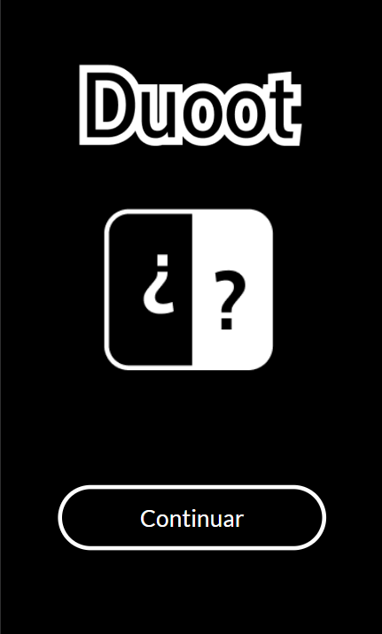
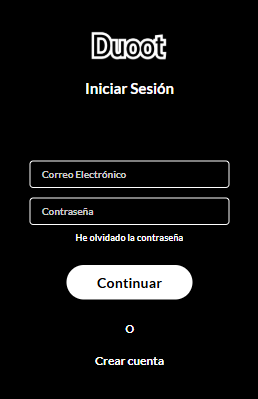
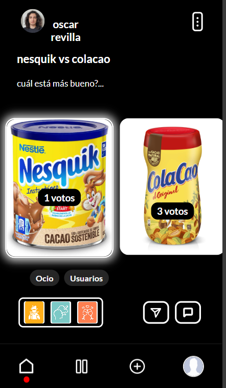
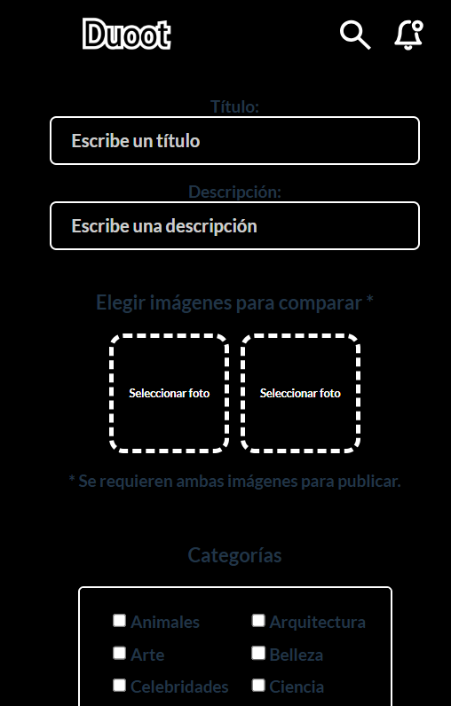

# Duoot 🌟

**Duoot** es una red social interactiva donde las decisiones importan. Los usuarios crean publicaciones con dos opciones, como por ejemplo **Playa 🏖️ o Montaña 🏔️**, y la comunidad vota por su favorita y comenta el porqué de su elección. ¡Descubre qué prefieren las personas y diviértete participando en debates y encuestas!

---

## Vista previa de la aplicación 🖼️

### Página de Inicio


### Crear una publicación


### Visualización de una publicación


### Iniciar sesión


---

## Características principales ✨

- 🎭 **Crea posts con dos opciones**: Comparte tus dilemas o decisiones para que la comunidad vote.
- 📊 **Votaciones en tiempo real**: Observa cómo la comunidad vota y se inclina por una opción.
- 💬 **Sección de comentarios**: Discute y comparte tus razones con otros usuarios.
- 🔥 **Diseño amigable e intuitivo**: Fácil de usar, divertido y accesible para todos.
- 🌍 **Explora tendencias**: Descubre qué decisiones son más populares entre la comunidad.

---

## ¿Cómo funciona? 🚀

1. **Regístrate**: Crea tu cuenta en **Duoot** para empezar.
2. **Crea un post**: Elige dos opciones para que los demás decidan.
3. **Participa**: Vota en publicaciones de otros usuarios y comparte tus opiniones.
4. **Interactúa**: Responde en los comentarios y conecta con personas que piensan como tú (¡o no!).

---

## Ejemplo de uso 📝

Imagina que tienes una duda o simplemente curiosidad, como:

> _¿Qué prefieres?_

- **Playa** 🏖️
- **Montaña** 🏔️

Los usuarios podrán votar por su opción favorita y comentar por qué prefieren una u otra. ¡Es una forma genial de interactuar y descubrir preferencias!

---

## Instalación ⚙️

Para los interesados en probar o contribuir al desarrollo, sigue estos pasos:

1. Clona el repositorio:
   ```bash
   git clone https://github.com/tu-usuario/duoot.git
